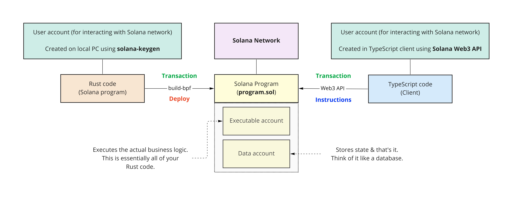

# Math Stuff

Working with data accounts on Solana.

## How it works:

### Rust (On-Chain Solana Programs)

First we write the on-chain programs that will handle the business logic of whatever it is we want to do.   
   
In this case, we are just performing some math calculations on some account data.   
   
These are deployed to the Solana network, and each one lives in an `executable program` - which is also called an `executable account`.   

They store data - such as schema details - but not your traditional persisted data.

### TypeScript (Client)

Next we invoke the on-chain programs by using the same local keypair (the one we used to deploy our Rust programs) to create 
an account that will transact with the math programs we deployed.   

This is our client account.   

**The important part here is that the account we just created is actually owned by the program we intend to hit**.

Steps:
- Get the local Keypair used to deploy the math programs.
- Get the intended program's ID.
- Create an account under the same program ID (also using the local Keypair). This account will store data of it's own.
- **Now that we have an account that shares the same program ID (owner), the on-chain program can modify the account's data**.
- Ping the program and trigger the math calculation, using our created account, to modify our created account's data.
