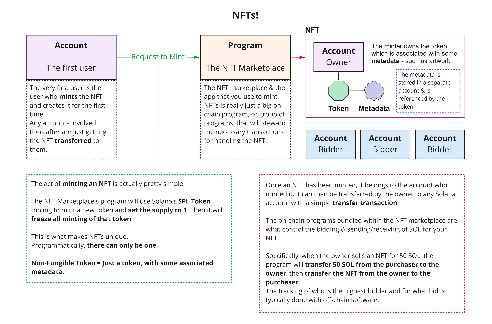
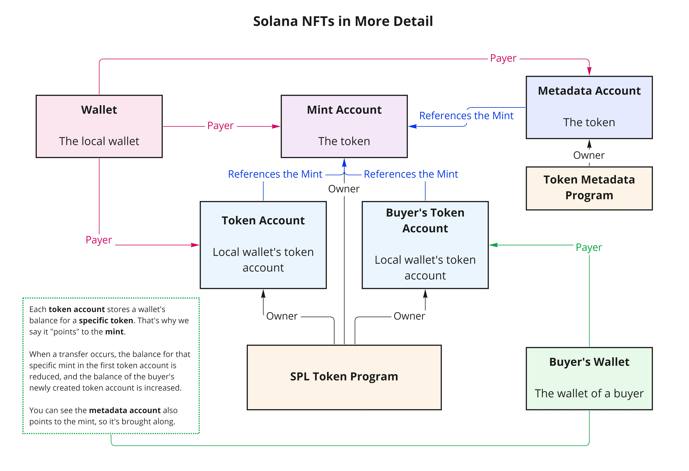

# NFTs!

We use Anchor - both for the client-side and on-chain code - in each example in this repository except for `mint-nft-raw`. That one is just Solana crates & libs.

| Repository         | Description                                                |
| ------------------ | ---------------------------------------------------------- |
| `mint-nft-raw` | Mint an NFT to your local wallet using **only Solana crates & packages**. |
| `mint-nft` | Mint an NFT to your local wallet using **Anchor**, including metadata using **Metaplex**. |
| `sell-nft` | Sell one of your NFTs to another Solana wallet. Receive SOl from & transfer NFT to buyer. |
| `nft-collection` | Sample application using Metaplex's Candy Machine. Demonstrates minting & selling NFTs, driveable from the UI. |
| `nft-marketplace` | Sample application demonstrating use of Solana account model to simulate a small NFT marketplace with bidding & selling of NFTs. |
| `nft-marketplace-live` | Same as previous example but with live price changes based on transactions from a particular NFT. |

## How NFTs Work

